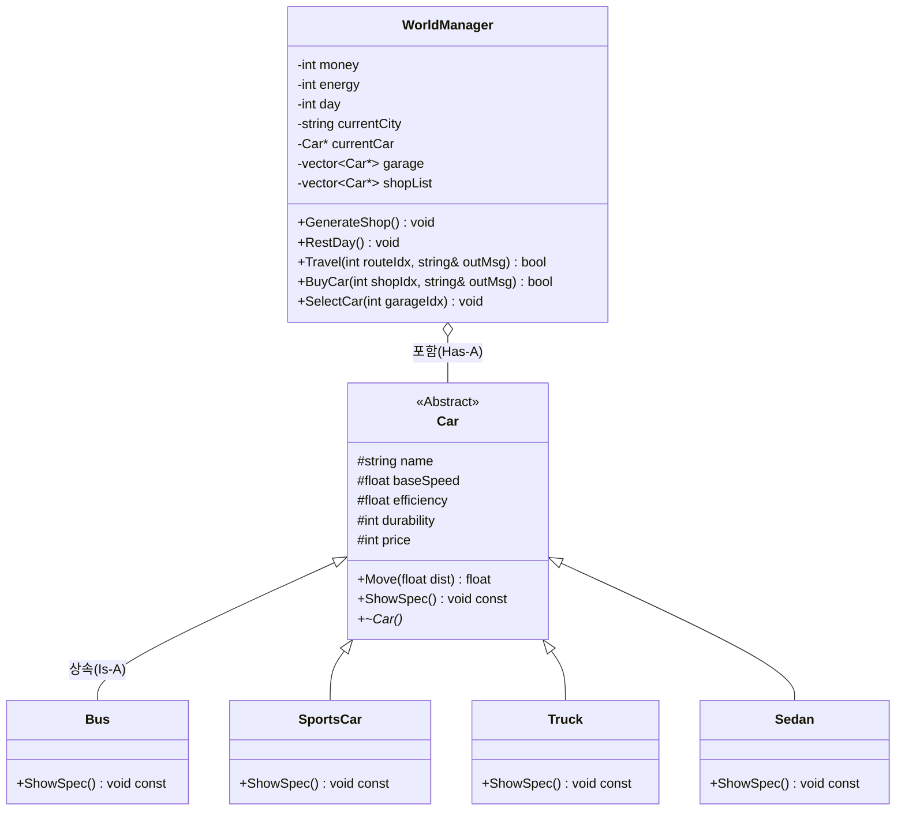
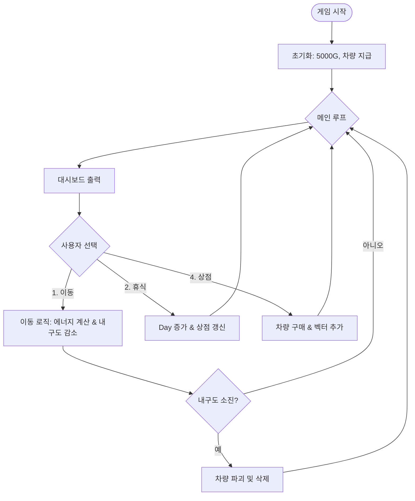

# 01. PolyDrive 전체 구조 및 OOP 설계

이 문서는 **PolyDrive** 게임의 전체적인 설계 구조와 객체 지향 프로그래밍(OOP)이 왜 필요한지에 대해 설명합니다.

## 1. 프로젝트 설계 목표
- **상속(Inheritance)**을 통해 중복 코드를 제거합니다.
- **다형성(Polymorphism)**을 통해 하나의 인터페이스로 다양한 차량을 제어합니다.
- **캡슐화(Encapsulation)**를 통해 데이터와 로직을 매니저 클래스에 안전하게 보관합니다.

---

## 2. 클래스 다이어그램 (Class Diagram)
객체 간의 관계를 한눈에 보여주는 설계도입니다.

### 핵심 포인트:
- **Is-A 관계**: "Bus는 Car이다." (상속)
- **Has-A 관계**: "WorldManager는 Car(들)을 가지고 있다." (포함/벡터)

---

## 3. 게임 플로우차트 (Flowchart)
사용자의 선택에 따라 로직이 어떻게 흐르는지 보여주는 순서도입니다.

---

## 5. 단계별 학습 가이드
이 프로젝트를 깊이 있게 이해하려면 아래 순서대로 문서를 읽어보세요.

1. **[02. Car Class](02_Car_Class.md)**: 모든 차량의 근간이 되는 추상 기반 클래스 설계
2. **[03. Inheritance](03_Inheritance.md)**: 자식 클래스에서 부모의 기능을 확장하고 재정의하는 법
3. **[04. Vector Management](04_Vector_Management.md)**: 동적 할당된 객체들을 안전하게 관리하고 해제하는 기술
4. **[05. Game Loop](05_Game_Loop.md)**: 매니저 클래스들이 협력하여 게임을 구동하는 원리
5. **[06. Shop System](06_Shop_System.md)**: **상속과 다형성의 정점.** 상점에서 무작위 객체가 생성되고 관리되는 과정
6. **[07. Troubleshooting](07_Troubleshooting.md)**: **실전 문제 해결.** 개발 중 겪은 C++ 메모리 및 설계 이슈 정리

---

## 4. 왜 OOP인가?
(이하 생략)
