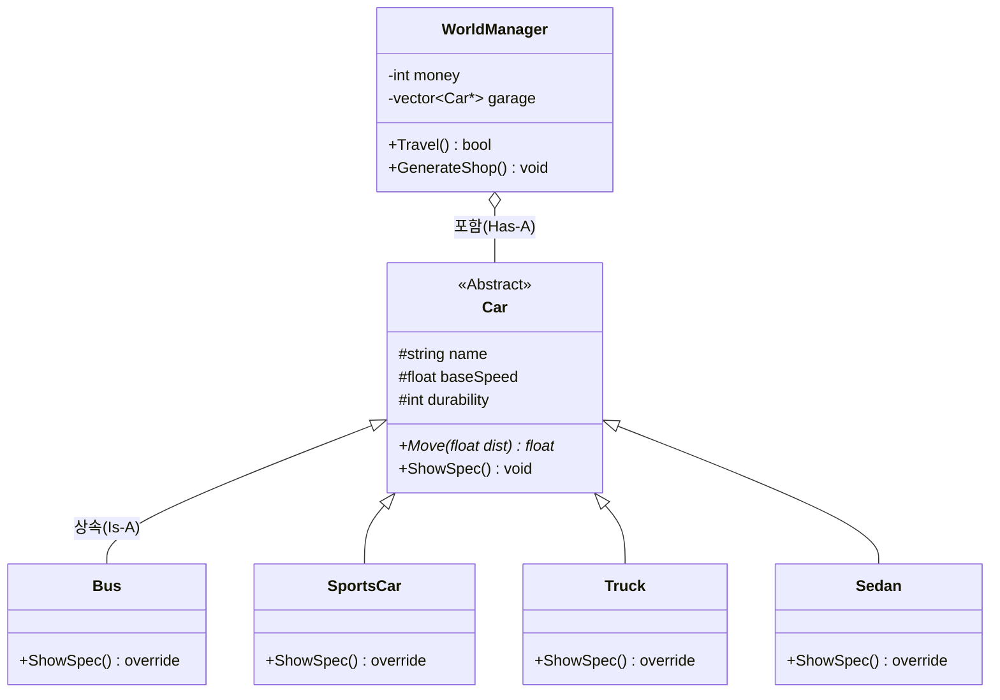

# 01. PolyDrive 전체 구조 및 OOP 설계

이 문서는 **PolyDrive** 게임의 전체적인 설계 구조와 객체 지향 프로그래밍(OOP)이 왜 필요한지에 대해 설명합니다.

## 1. 프로젝트 설계 목표
- **상속(Inheritance)**을 통해 중복 코드를 제거합니다.
- **다형성(Polymorphism)**을 통해 하나의 인터페이스로 다양한 차량을 제어합니다.
- **캡슐화(Encapsulation)**를 통해 데이터와 로직을 매니저 클래스에 안전하게 보관합니다.

---

## 2. 클래스 다이어그램 (Class Diagram)
객체 간의 관계를 한눈에 보여주는 설계도입니다.

### 핵심 포인트:
- **Is-A 관계**: "Bus는 Car이다." (상속)
- **Has-A 관계**: "WorldManager는 Car(들)을 가지고 있다." (포함/벡터)

---

## 3. 게임 플로우차트 (Flowchart)
사용자의 선택에 따라 로직이 어떻게 흐르는지 보여주는 순서도입니다.

---

## 4. 왜 OOP인가?
만약 상속을 사용하지 않는다면, `Bus`, `Truck`, `SportsCar` 마다 각각 이동 로직과 출력 로직을 따로 만들어야 합니다. 하지만 **상속**을 사용하면 공통된 속성은 `Car`에 두고, 각 차량은 자신만의 특징만 정의하면 되므로 코드가 훨씬 간결해집니다.
