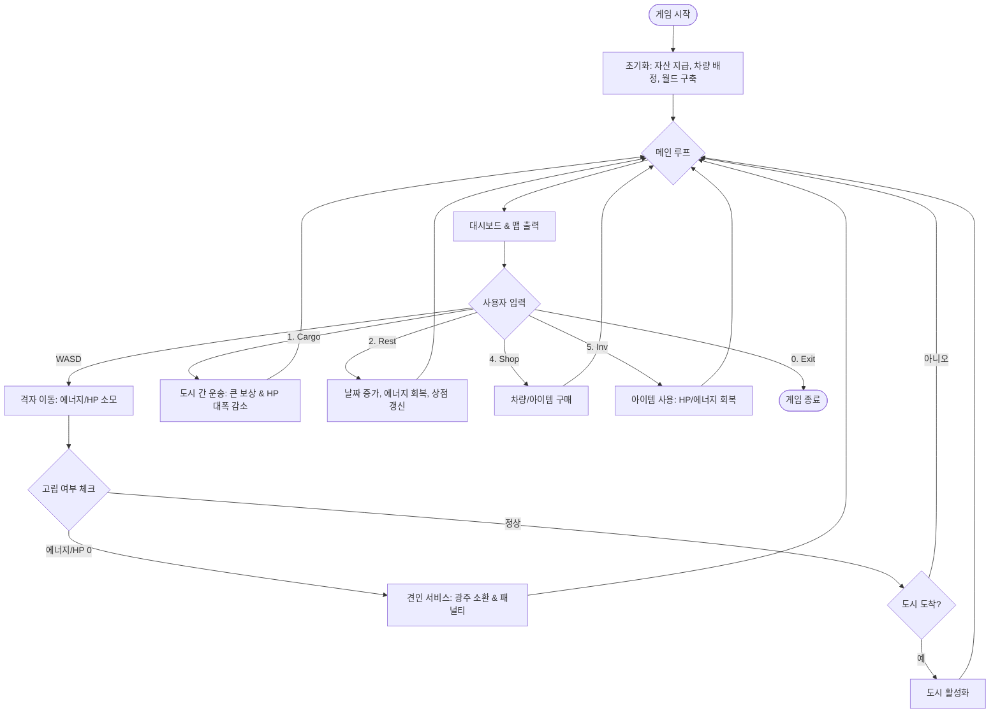

# 🏎️ PolyDrive: Core Instructions & Guidelines

이 문서는 PolyDrive 프로젝트의 일관성을 유지하고 효율적인 개발을 위한 핵심 지침입니다. 모든 수정 및 확장 작업은 이 가이드를 최우선으로 따릅니다.

---

## 🛠️ Code Conventions (C++ Standards)

### 1. Naming Conventions
- **Classes / Structs**: `PascalCase` (예: `WorldManager`, `MapManager`)
- **Methods / Functions**: `PascalCase` (예: `DrawGame()`, `MovePlayer()`)
- **Variables / Members**: `camelCase` (예: `currentCity`, `money`)
- **Enums**: `PascalCase` (예: `enum class CarType`)
- **Constants**: `SCREAMING_SNAKE_CASE` (예: `INITIAL_MONEY`)
- **Namespaces**: `PascalCase` (예: `WorldData`)

### 2. Architecture Principles
- **Memory Management**: 현대적 C++(`std::unique_ptr`, `std::shared_ptr`) 사용을 우선하되, `City`와 같이 전역적으로 공유되는 객체는 포인터 관리를 명확히 합니다.
- **Separation of Concerns**: Logic(`WorldManager`), Rendering(`UIManager`), Data(`WorldData`)를 엄격히 분리합니다.
- **OOP Integrity**: 상속과 다형성을 적극 활용하여 새로운 차량이나 아이템 추가 시 기존 코드를 수정하지 않는 개폐 원칙(OCP)을 준수합니다.

---

## 🔄 Final Game Flowchart

---

## 📚 Documentation Structure (Specifications)

각 구현부의 상세 기술 명세는 아래 문서에서 관리합니다:

1. **`DOCS/Spec_Architecture.md`**: 매니저 클래스 구조 및 게임 루프 제어.
2. **`DOCS/Spec_Vehicle.md`**: `Car` 클래스 상속 구조 및 다형성 인터페이스.
3. **`DOCS/Spec_World.md`**: 격자 기반 이동 및 그래프 기반 도시 네트워크.
4. **`DOCS/Spec_Economy.md`**: 보상 알고리즘, 아이템 및 상점 시스템.
5. **`DOCS/Spec_UI.md`**: Windows API 기반 렌더링 및 인터페이스 설계.

*이전 개발 기록은 `DOCS/DevLog/` 폴더를 참조하세요.*
