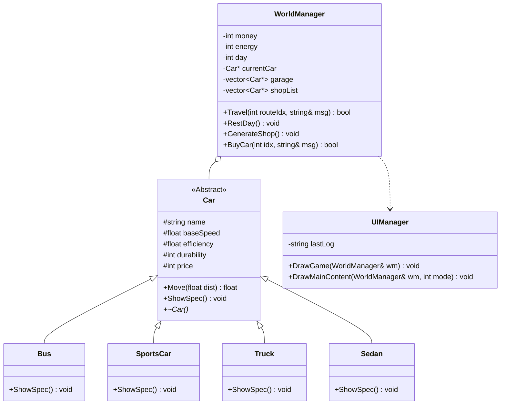
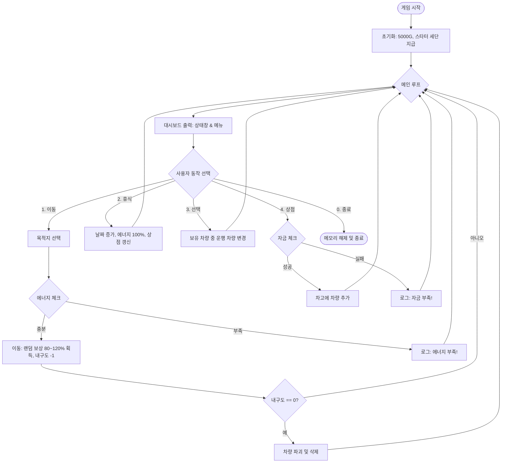

# 02주차 과제
---
# 🏎️ PolyDrive: Highway Delivery Simulator

**PolyDrive**는 다양한 차량을 운전하며 도시 간 물류를 운송하고 자산을 불려 나가는 **텍스트 기반 하이웨이 시뮬레이션 게임**입니다. C++의 객체 지향 프로그래밍(OOP) 핵심 원칙인 **상속과 다형성**을 실무적인 게임 로직에 적용하여 설계되었습니다.

---
# 유튜브
 
---

## 🎮 Game Overview

- **목적**: 제한된 에너지와 차량 내구도를 관리하며 최대한 많은 수익을 창출하세요.
- **핵심 루프**: 
  1. **상점**: 랜덤하게 등장하는 6대의 차량 중 연비와 성능을 고려해 구매합니다.
  2. **관리**: 보유한 차량 중 현재 운행할 차량을 선택합니다.
  3. **운송**: 목적지별 거리와 에너지를 계산하여 이동하고 보상을 획득합니다.
  4. **휴식**: 하루를 마무리하며 에너지를 충전하고 상점 물건을 갱신합니다.

---

## 🛠️ System Architecture

### 1. Class Diagram
차량 시스템은 추상 기반 클래스인 `Car`를 중심으로 설계되었습니다. 모든 차량은 동일한 인터페이스를 가지지만, 실제 동작은 각 자식 클래스에서 정의된 스탯과 특성에 따라 다르게 나타납니다.

### 2. Game Flowchart
사용자의 입력에 따른 게임 흐름과 데이터 변화를 나타냅니다.

---

## 📊 Technical Features

### 1. Polymorphism (다형성)
- `Car` 클래스의 `ShowSpec()`을 가상 함수로 정의하여, `WorldManager`가 `vector<Car*>` 내의 어떤 차량 객체든 일관된 방식으로 상세 정보를 출력할 수 있게 구현했습니다.
- 이동 로직(`Move`)을 통해 내구도 감소 및 소요 시간 계산을 캡슐화했습니다.

### 2. Factory Logic & Randomization
- **능력치 보정**: 모든 차량은 생성 시 기본 스탯의 **0.7배 ~ 1.3배** 사이의 랜덤 보정을 받아, 같은 종류의 차량이라도 매번 다른 성능을 가집니다.
- **이름 풀**: `WorldData.h`에 정의된 각 차량 클래스별 20개의 고유 이름 풀에서 랜덤하게 명명됩니다.
- **가변 보상**: 이동 보상은 지역별 기본값의 **+/- 20%** 범위에서 결정되어 매 판 다른 수익을 제공합니다.

### 3. Resource Management
- **에너지 시스템**: 거리와 차량의 **연비(Efficiency)**에 따라 소요 에너지가 실시간으로 계산됩니다.
- **내구도 시스템**: 모든 차량은 **1~3회**의 이동 기회만 가지는 소모품으로 설정되어, 플레이어에게 지속적인 차량 교체와 자금 관리의 동기를 부여합니다.

---

## 🚗 Vehicle Specs (Base Balance)

| Type | Speed | Efficiency | Durability | Price | 특성 |
| :--- | :--- | :--- | :--- | :--- | :--- |
| **Bus** | 70 km/h | 4.0 km/E | 1~3 | 3000 G | 평균적인 속도와 가격 |
| **SportsCar** | 140 km/h | 6.0 km/E | 1~3 | 5000 G | 매우 빠른 이동 속도 |
| **Truck** | 60 km/h | 10.0 km/E | 1~3 | 4000 G | 압도적인 에너지 효율 |
| **Sedan** | 90 km/h | 8.0 km/E | 1~3 | 2500 G | 저렴하고 균형 잡힌 스탯 |

*모든 차량은 상점 등장 시 위 기본 수치에서 +/- 30% 보정이 적용됩니다.*

## 단계별 학습 가이드
이 프로젝트를 깊이 있게 이해하려면 아래 순서대로 문서를 읽어보세요.

0. **[01. Overview](DOCS/01_Overview.md)**: PolyDrive 전체 구조 및 OOP 설계
1. **[02. Car Class](DOCS/02_Car_Class.md)**: 모든 차량의 근간이 되는 추상 기반 클래스 설계
2. **[03. Inheritance](DOCS/03_Inheritance.md)**: 자식 클래스에서 부모의 기능을 확장하고 재정의하는 법
3. **[04. Vector Management](DOCS/04_Vector_Management.md)**: 동적 할당된 객체들을 안전하게 관리하고 해제하는 기술
4. **[05. Game Loop](DOCS/05_Game_Loop.md)**: 매니저 클래스들이 협력하여 게임을 구동하는 원리
5. **[06. Shop System](DOCS/06_Shop_System.md)**: **상속과 다형성의 정점.** 상점에서 무작위 객체가 생성되고 관리되는 과정
6. **[07. Troubleshooting](DOCS/07_Troubleshooting.md)**: **실전 문제 해결.** 개발 중 겪은 C++ 메모리 및 설계 이슈 정리
