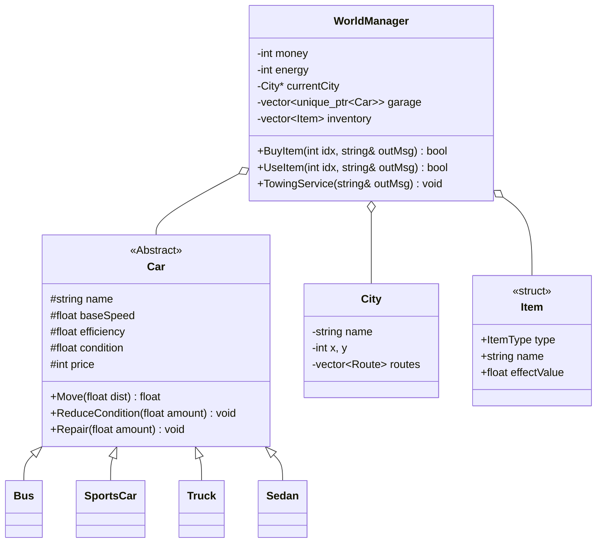
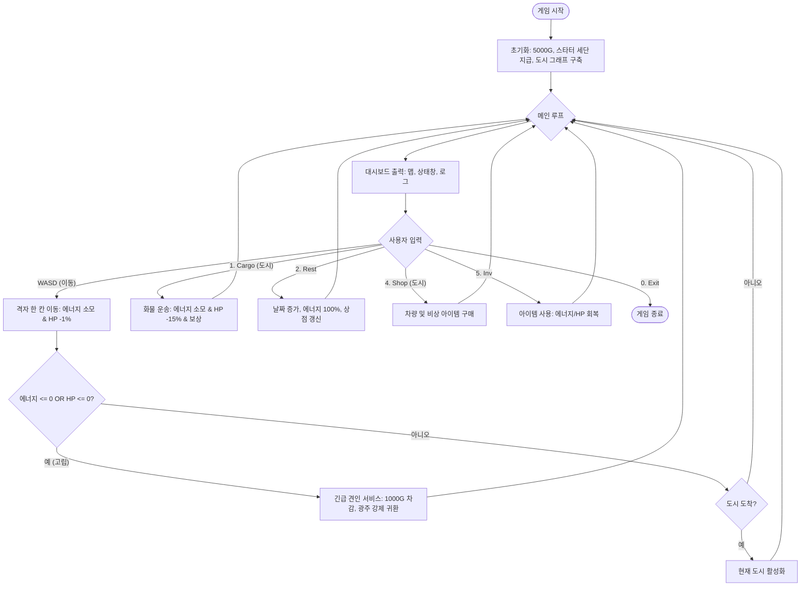

# 🏎️ PolyDrive: Highway Delivery Simulator

**PolyDrive**는 다양한 차량을 운전하며 도시 간 물류를 운송하고 자산 불려 나가는 **텍스트 기반 하이웨이 시뮬레이션 게임**입니다. C++의 객체 지향 프로그래밍(OOP) 핵심 원칙인 **상속과 다형성**을 실무적인 게임 로직에 적용하여 설계되었습니다.

---
# 유튜브
 
---

## 🎮 Game Overview

- **목적**: 제한된 에너지와 차량 내구도(HP)를 관리하며 최대한 많은 수익을 창출하세요.
- **핵심 루프**: 
  1. **탐험**: WASD 방향키로 격자 지도를 이동하며 도시를 찾습니다.
  2. **상점**: 차량 및 비상용 아이템(연료, 수리 키트)을 구매합니다.
  3. **운송**: 도시 간 화물을 운송하여 보상을 획득하고 자산을 불립니다.
  4. **관리**: 인벤토리의 아이템을 사용하여 위기 상황(에너지/HP 고갈)을 극복합니다.

---

## 🛠️ System Architecture

### 1. Class Diagram
차량 시스템은 추상 기반 클래스인 `Car`를 중심으로 설계되었습니다. 도시 시스템은 그래프 구조로, 아이템 시스템은 인벤토리 기반으로 구축되었습니다.

### 2. Game Flowchart
사용자의 입력에 따른 게임 흐름과 데이터 변화를 나타냅니다.

---

## 📊 Technical Features

### 1. Polymorphism (다형성)
- `Car` 클래스의 `ShowSpec()`을 가상 함수로 정의하여, 일관된 인터페이스로 다양한 차량의 상태(HP, 연비 등)를 출력합니다.

### 2. Graph & Grid Architecture
- **그래프 구조**: 도시를 객체(Node)로 연결하여 실제 지리적 연결망을 시뮬레이션합니다.
- **격자 이동**: `MapManager`를 통해 WASD 기반의 실시간 위치 좌표 이동을 구현했습니다.

### 3. Risk Management (리스크 관리)
- **HP 시스템**: 단순 횟수제가 아닌 % 기반 체력 시스템을 도입하여 세밀한 차량 관리가 필요합니다.
- **아이템/인벤토리**: 연료 고갈이나 차량 파손에 대비한 비상 물품 구매 및 사용 시스템을 갖추고 있습니다.
- **견인 패널티**: 자원 관리 실패 시 금전적 손실과 함께 시작 지점으로 강제 회송되는 패널티를 부여합니다.

---

## 🚗 Vehicle Specs (Base Balance)

| Type | Speed | Efficiency | 특성 |
| :--- | :--- | :--- | :--- |
| **Bus** | 70 km/h | 4.0 km/E | 평균적인 속도와 가격 |
| **SportsCar** | 140 km/h | 6.0 km/E | 도로 위에서 매우 빠름 |
| **Truck** | 60 km/h | 10.0 km/E | 압도적인 에너지 효율 |
| **Sedan** | 90 km/h | 8.0 km/E | 저렴하고 균형 잡힌 스탯 |

---

## 단계별 학습 가이드
이 프로젝트를 깊이 있게 이해하려면 아래 순서대로 문서를 읽어보세요.

0. **[01. Overview](DOCS/01_Overview.md)**: PolyDrive 전체 구조 및 OOP 설계
1. **[02. Car Class](DOCS/02_Car_Class.md)**: 모든 차량의 근간이 되는 추상 기반 클래스 설계
2. **[03. Inheritance](DOCS/03_Inheritance.md)**: 자식 클래스에서 부모의 기능을 확장하고 재정의하는 법
3. **[04. Vector Management](DOCS/04_Vector_Management.md)**: 동적 할당된 객체들을 안전하게 관리하고 해제하는 기술
4. **[05. Game Loop](DOCS/05_Game_Loop.md)**: 매니저 클래스들이 협력하여 게임을 구동하는 원리
5. **[06. Shop System](DOCS/06_Shop_System.md)**: **상속과 다형성의 정점.** 상점에서 무작위 객체가 생성되고 관리되는 과정
6. **[07. Troubleshooting](DOCS/07_Troubleshooting.md)**: **실전 문제 해결.** 개발 중 겪은 C++ 메모리 및 설계 이슈 정리
7. **[08. Graph System](DOCS/08_Graph_System.md)**: **심화 설계.** 문자열 기반 시스템을 객체 지향적 그래프 구조로 리팩토링하는 법
8. **[09. Item and Condition](DOCS/09_Item_and_Condition.md)**: **전략적 확장.** HP 시스템과 인벤토리를 통한 리스크 관리 설계
