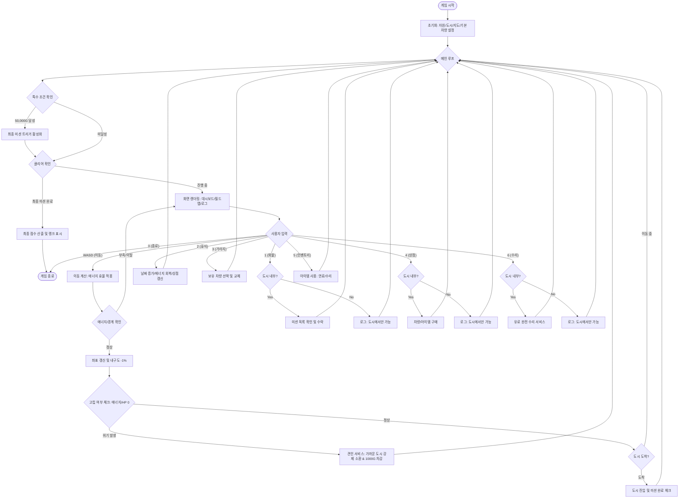

# 🏎️ PolyDrive: Modern C++ Logistics Simulator

**PolyDrive**는 현대적인 C++ 기술을 활용하여 제작된 그리드 기반 물류 시뮬레이션 게임입니다. 플레이어는 대한민국 주요 도시를 배경으로 한 가상의 맵에서 다양한 차량을 운전하며 화물을 배송하고, 자산을 관리하여 최종 미션인 'The Golden Cargo'를 완수해야 합니다.

---

## 📑 목차
1. [프로젝트 개요](#1-프로젝트-개요)
2. [핵심 게임 메커니즘](#2-핵심-게임-메커니즘)
3. [기술 아키텍처 & 상세 구현](#3-기술-아키텍처--상세-구현)
4. [시스템 상세 사양](#4-시스템-상세-사양)
5. [개발자 가이드 & 확장성](#5-개발자-가이드--확장성)
6. [조작 방법 및 플레이 흐름](#6-조작-방법-및-플레이-흐름)

---

## 1. 프로젝트 개요
PolyDrive는 단순한 이동을 넘어 **자원 관리(에너지, 내구도, 자산)**와 **전략적 차량 선택**이 결합된 시뮬레이터입니다. 각 차량은 고유한 속도, 효율성, 내구도를 가지며, 지형(그리드)을 이동할 때마다 실시간으로 자원이 소모됩니다.

- **개발 언어**: C++ 20 (MSVC 환경 최적화)
- **주요 기술**: OOP, 다형성, 스마트 포인터(RAII), ANSI Console Rendering
- **목표**: 50,000G를 모아 최종 미션을 활성화하고 클리어하여 최고의 랭크(S)를 획득하는 것.

---

## 2. 핵심 게임 메커니즘

### 🗺️ 월드 및 이동 시스템
- **그리드 맵**: 40x40 사이즈의 가상 그리드에서 WASD 기반 사방향 이동을 지원합니다.
- **도시 네트워크**: 광주, 전주, 대전, 부산, 서울, 강릉 등 실제 도시의 좌표를 투영하였습니다.
- **자원 소모**: 이동 시 차량의 `Efficiency` 수치에 비례하여 에너지가 소모되며, 매 칸마다 내구도(HP)가 1%씩 감소합니다.

### 🚛 차량 및 다형성 시스템
차량은 `Car` 베이스 클래스를 상속받아 구현되며, 상점에서 무작위 스펙으로 생성됩니다.
- **Sedan**: 균형 잡힌 기본 차량.
- **Bus**: 높은 안정성과 거점 이동에 최적화.
- **Truck**: 높은 에너지 효율성(낮은 에너지 소모)을 자랑하는 물류 최적화 차량.
- **SportsCar**: 압도적인 속도를 가졌으나 유지비와 효율성이 낮음.

### 💰 경제 및 미션 시스템
- **Cargo Mission**: 각 도시에서 목적지까지 화물을 배송하고 보상을 받습니다.
- **Shop & Item**: 상점에서 차량 및 긴급 연료, 수리 키트 등을 구매할 수 있습니다.
- **Towing Service**: 고립 상황 시 가장 가까운 도시로 견인되며 패널티가 발생합니다.

---

## 3. 기술 아키텍처 & 상세 구현

### 📂 Module Architecture & File Map
| 분류 | 파일명 | 역할 및 핵심 로직 |
| :--- | :--- | :--- |
| **Core** | `Main.cpp`, `WorldManager`, `MapManager` | 게임 루프, 자산/미션 관리, 그리드 좌표 및 충돌 판정 |
| **Vehicle** | `Car.h`, `Sedan/Bus/Truck/SportsCar.h` | 다형성 기반 차량 인터페이스 및 타입별 고유 로직 |
| **Data** | `City.h`, `WorldData.h`, `Item.h` | 그래프 구조(Node/Edge), 상수 데이터 풀, 아이템 정의 |
| **UI** | `UIManager` | ANSI Code 기반 부분 갱신 콘솔 렌더링 |

### 🧬 Technical Deep Dive
- **Polymorphic Management**: `std::vector<std::unique_ptr<Car>>`를 통해 객체 수명을 안전하게 관리(RAII)하며, 가상 함수를 통해 동일한 이동 인터페이스를 공유합니다.
- **Hybrid System**: 로컬의 40x40 **그리드 이동**과 글로벌의 **그래프 기반 거리/보상** 시스템이 공존합니다. 이동 비용은 `ceil(10.0 / car->Efficiency)` 공식을 따릅니다.
- **Rendering Optimization**: Windows API의 `SetConsoleCursorPosition`을 활용하여 화면 전체를 지우지 않고 변경된 부분만 덮어쓰는 방식으로 깜빡임을 최소화했습니다.

---

## 4. 시스템 상세 사양

### 📦 미션 및 경제 로직
- **Reward Algorithm**: `Base Reward` × `Random Multiplier(0.8 ~ 1.2)`
- **The Golden Cargo**: 자산 50,000G 도달 시, 현재 위치에서 가장 먼 도시를 목적지로 하는 최종 미션이 트리거됩니다.

### 📊 점수 및 랭킹 시스템
- **Base Score**: 10,000 pts
- **Penalty**: 소요 일수(-100/일), 견인 횟수(-500/회)
- **Bonus**: 보유 차량 대수(+1,000/대)
- **Ranks**: S (9000+) / A (7000+) / B (5000+) / C (3000+) / F (Under 3000)

### 🛠️ 수리 시스템
- **도시 수리점**: 1% 수리당 25G가 소모되는 완전 복구 수단.
- **휴대용 수리 키트**: 필드 어디서나 사용 가능하지만 구매 비용 대비 수리 효율이 상이함.

---

## 5. 개발자 가이드 & 확장성

### 🚀 빌드 및 실행
1. `PolyDrive.slnx`를 Visual Studio에서 열어 `x64` 모드로 빌드합니다.
2. ANSI 색상 지원을 위해 Windows Terminal 환경에서 실행을 권장합니다.

### ➕ 시스템 확장 (OCP 준수)
- **차량 추가**: `Car` 상속 후 `WorldManager::GenerateShop`에 타입 등록.
- **맵/도시 확장**: `WorldData.h`의 `CITIES`, `ROUTES` 리스트에 데이터 추가만으로 즉시 반영.
- **아이템 확장**: `Item.h`에 타입 추가 및 `WorldManager::UseItem` 로직 구현.

---

## 6. 조작 방법 및 플레이 흐름

### ⌨️ 조작키
- **WASD**: 필드 이동 (에너지/HP 소모)
- **1**: 화물 미션 수락 | **2**: 휴식 (에너지 회복, 상점 갱신)
- **3**: 가라지 (차량 교체) | **4**: 상점 (구매) | **5**: 인벤토리 (사용)
- **6**: 도시 수리소 (완전 수리) | **0**: 게임 종료

### 🔄 게임 루프 (Game Flow)

---

## 📚 7. 단계별 개발 기록 (Step-by-Step DevLog)

본 프로젝트의 설계 과정과 핵심 기술 구현 단계를 상세히 기록한 문서입니다. C++ 및 OOP 학습에 입문하시는 분들을 위해 단계별 가이드를 제공합니다.

- **[01. Overview](DOCS/DevLog/01_Overview.md)**: 프로젝트 전체 아키텍처 및 설계 원칙 개요
- **[02. Car Class](DOCS/DevLog/02_Car_Class.md)**: 차량 추상 클래스 설계 및 캡슐화
- **[03. Inheritance](DOCS/DevLog/03_Inheritance.md)**: 상속을 통한 다양한 차량 타입(Bus, Truck 등) 확장
- **[04. Vector Management](DOCS/DevLog/04_Vector_Management.md)**: 동적 배열 관리 및 객체 수명 주기 제어
- **[05. Game Loop](DOCS/DevLog/05_Game_Loop.md)**: 사용자 입력 처리 및 프레임 기반 메인 루프 설계
- **[06. Shop System](DOCS/DevLog/06_Shop_System.md)**: 상점 시스템 및 무작위 데이터 생성 로직 구현
- **[07. Troubleshooting](DOCS/DevLog/07_Troubleshooting.md)**: 개발 중 발생한 버그 및 메모리 이슈 해결 과정
- **[08. Graph System](DOCS/DevLog/08_Graph_System.md)**: 그래프(Node/Edge) 기반 도시 네트워크 아키텍처
- **[08. Modern C++ Memory](DOCS/DevLog/08_Modern_CPP_Memory.md)**: 스마트 포인터(RAII)를 활용한 현대적 메모리 관리
- **[09. Item and Condition](DOCS/DevLog/09_Item_and_Condition.md)**: 내구도/에너지 시스템 및 아이템 활용 로직

---

*본 프로젝트는 C++ 프로그래밍 교육 및 시뮬레이션 로직 설계를 위해 제작되었습니다.*
